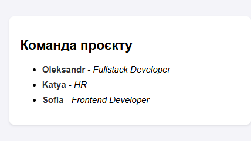
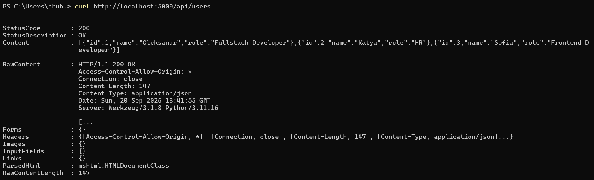
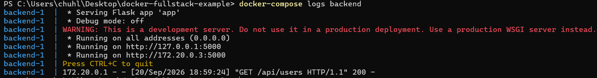
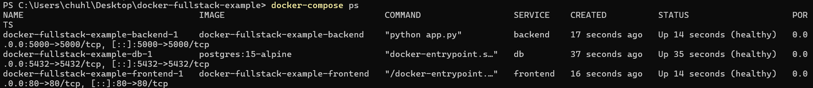

# Docker Fullstack Example (Nginx + Flask + PostgreSQL)

Цей проєкт є прикладом контейнеризації класичного Fullstack-додатка за допомогою Docker Compose. Система складається з трьох окремих сервісів: **Frontend** (Nginx), **Backend** (Python Flask REST API) та **Database** (PostgreSQL), які функціонують у спільній ізольованій Docker-мережі.

---

## Демонстрація роботи

### 1. Веб-інтерфейс (Frontend)
Фронтенд на базі Nginx віддає веб-сторінку, яка автоматично робить REST API запит до бекенду та відображає список користувачів з бази даних:



---

### 2. REST API (Backend)
Бекенд на Flask обробляє запит за адресою `/api/users`, отримує дані з PostgreSQL і повертає їх у форматі JSON:



---

### 3. Логування сервісів (`docker logs`)
Демонстрація перегляду логів роботи бекенд-сервісу за допомогою команд Docker Compose:



---

### 4. Статус здоров'я контейнерів (`healthcheck`)
Перевірка успішного проходження автоматичних тестувань стану здоров'я (`healthy`) для кожного контейнера:



---

## Додаткові можливості

* **Конфігурація через `.env`:** Усі параметри підключення та секрети винесені у файл середовища `.env` (шаблон надано у `.env.example`).
* **Healthchecks:** Контейнери мають автоматичну перевірку стану (`healthcheck`). Сервіс бекенду чекає повної готовності бази даних перед стартом.
* **Логування:** Підтримується перегляд логів усіх компонентів системи через `docker-compose logs`.

---

## Технологічний стек

* **Frontend:** Nginx (Alpine), HTML5, JavaScript (Fetch API)
* **Backend:** Python 3.11, Flask, Flask-CORS, psycopg2
* **Database:** PostgreSQL 15 (Official Image)
* **Orchestration:** Docker, Docker Compose (Bridge Network, Volumes)

---

## Структура проєкту

```text
docker-fullstack-example/
├── docker-compose.yml       # Оркестрація контейнерів, мережі та healthcheck
├── init.sql                 # Початковий SQL-скрипт ініціалізації БД
├── .env.example             # Шаблон змінних середовища
├── .gitignore               # Ігнорування .env та тимчасових файлів
├── README.md                # Документація проєкту
├── assets/
│   ├── demo.png             # Скріншот веб-інтерфейсу (Frontend)
│   ├── demo2.png            # Скріншот JSON-відповіді (Backend API)
│   ├── demo3.png            # Скріншот логів контейнерів
│   └── demo4.png            # Скріншот статусу healthcheck
├── backend/
│   ├── Dockerfile           # Образ для Flask REST API
│   ├── app.py               # Код бекенду з ендпоінтом /api/users
│   └── requirements.txt     # Залежності Python
└── frontend/
    ├── Dockerfile           # Образ для Nginx
    └── index.html           # Головна сторінка UI